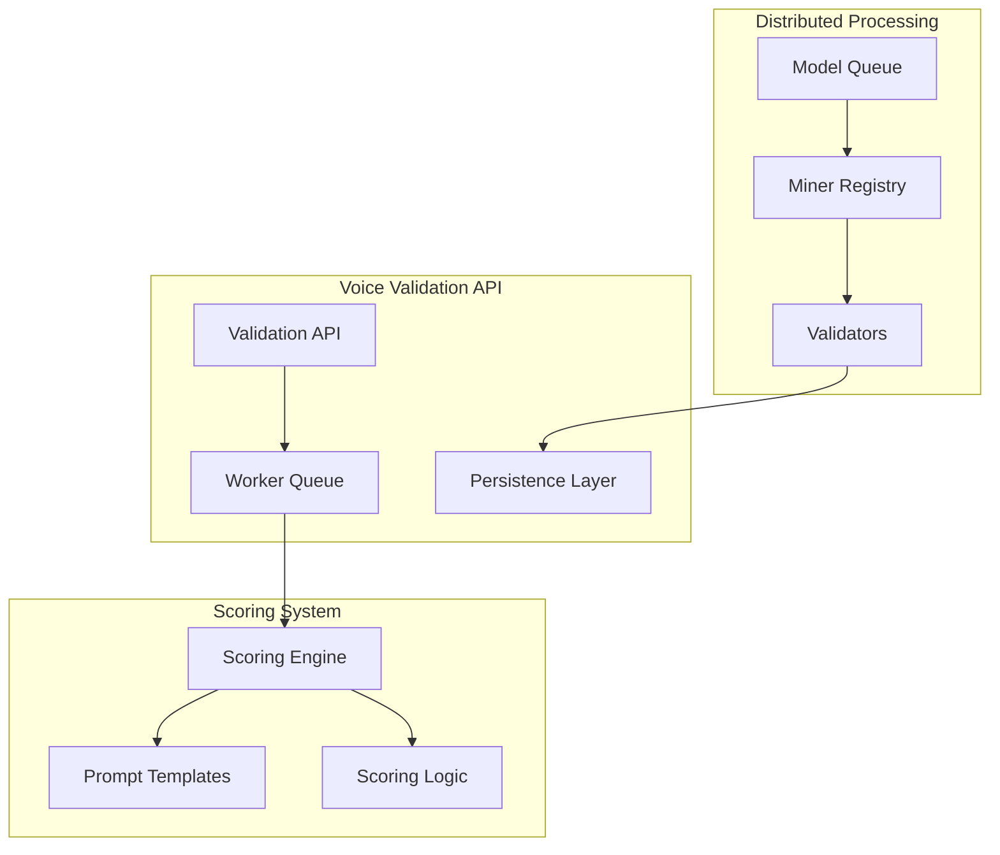
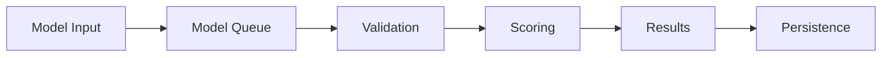
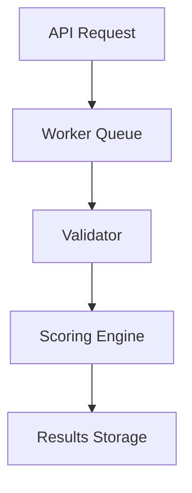
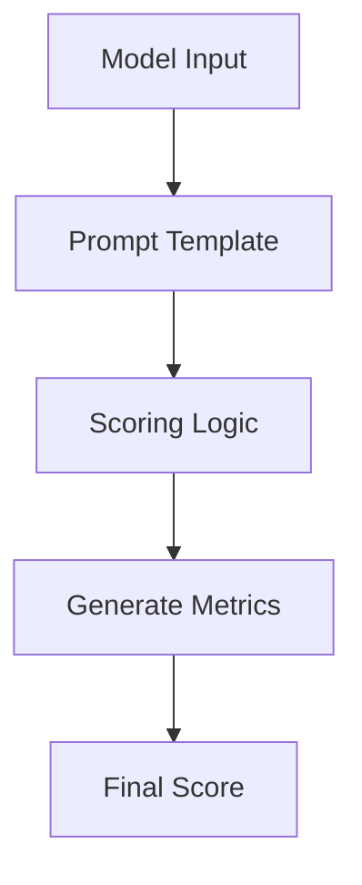

# System Patterns

## Architecture Overview

## Design Patterns

### 1. Microservices Pattern
- Decomposed into independent services
- Docker containerization
- Service-specific responsibilities
- Independent scaling

### 2. Queue-Based Processing
- Model queue management
- Worker queue for validation
- Asynchronous processing
- Load distribution

### 3. Registry Pattern
- Miner registry for tracking
- Validator registration
- Resource management
- Status tracking

### 4. Template Method Pattern
- Prompt templates for different models
- Standardized scoring methods
- Consistent validation approach
- Extensible framework

## Component Relationships

### Voice Validation API
- Handles incoming validation requests
- Manages worker queue
- Interfaces with persistence layer
- Coordinates with scoring system

### Scoring System
- Processes model evaluations
- Applies scoring logic
- Uses prompt templates
- Generates metrics

### Distributed Processing
- Manages model queue
- Coordinates miners
- Handles validation
- Resource allocation

## Technical Patterns

### 1. Data Flow

### 2. Validation Flow

### 3. Scoring Pattern

## Implementation Patterns

### 1. Service Structure
- Modular components
- Clear interfaces
- Service isolation
- Docker deployment

### 2. Data Management
- Persistent storage
- Queue management
- Result tracking
- Metric storage

### 3. Processing Pipeline
- Sequential processing
- Parallel validation
- Resource optimization
- Error handling

## Error Handling
1. Validation Failures
   - Graceful degradation
   - Error reporting
   - Retry mechanisms
   - Failure logging

2. Queue Management
   - Timeout handling
   - Resource cleanup
   - Queue recovery
   - State management

3. System Recovery
   - Service resilience
   - Data consistency
   - State recovery
   - Error propagation
